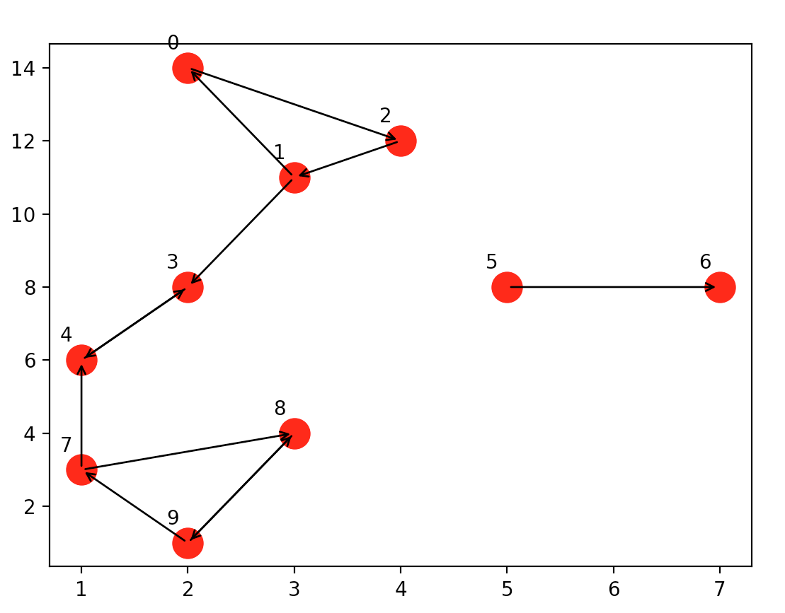

# Assignment 3

> Made by Itai Lashover and Liav weiss
>
> GitHub pages:  
> [https://github.com/ItaiLash](https://github.com/ItaiLash)  
> [https://github.com/liavweiss](https://github.com/liavweiss)


### Introduction
This project is an assignment in an object-oriented course at Ariel University.\
The project consists of two parts:\
The first part is an implenentation of directed weighted graph in python.\
The second part is comparative test of runtime in Python on a number of scenarios (graphs in different sizes) versus networkx and the first part of Assignment 2 done in Java (https://github.com/ItaiLash/ex2). \
We will detail the first part and the second part is documented in the wiki.

# Directed weighted graph:

## Node class
A simple class that represents a single vertex
Each node contain dew fields:
* key: node_id.
* location: node's position represent as 3DPoint.
* ni_out: a dictionary that holds all the "edges" that connected from this node, each edge is represented using a pair (key, edge weight).
* ni_in: a dictionary that holds all the "edges" that connected to this node, each edge is represented using a pair (key, edge weight)

| **Methods**      |    **Details**        |
|-----------------|-----------------------|
| `add_neighbor_out()` | Add "edge" that connected from this node (node_id ---> neighbor_id) |
| `add_neighbor_in()` | Add "edge" that connected to this node (neighbor_id ---> node_id) |
| `get_connections_out()` | Return a dictionary that holds all the "edges" that connected from this node |
| `get_connections_in()` | Return a dictionary that holds all the "edges" that connected to this node |
| `get_key()` | Return this node key |
| `get_location()` | Return this node location as a 3DPoint (x, y, z) |
| `set_location()` | Allows to add location to this node |
| `as_dict_node()` | Return the node as dictionary {"pos": "x", "y", "z", "id": key} |
| `as_dict_edge()` | Return the edge as dictionary {"src": node_id, "w": edge weight, "dest": node_id} |


## DiGraph class - implements GraphInterface

This class implement GraphInterface abstract class that represents an interface of a graph.

Each DiGraph contain dictionary of his nodes, and each node contain his edges.\
In addition each DiGraph holds the number of edges in the graph and a mode counter (mc)\
that represent the number of changes (add node, add edge, remove node or remove edge) in the graph.

| **Main methods**      |    **Details**        |
|-----------------|-----------------------|
| `v_size()` | Returns the number of vertices in this graph |
| `e_size()` | Returns the number of edges in this graph |
| `get_all_v()` | Return a dictionary of all the nodes in the Graph |
| `all_in_edges_of_node()` | Return a dictionary of all the nodes connected to (into) node_id |
| `all_out_edges_of_node()` | Return a dictionary of all the nodes connected from node_id |
| `get_mc()` | Returns the current version of this graph |
| `add_edge()` | Adds an edge to the graph |
| `add_node()` | Adds a node to the graph |
| `remove_node()` | Removes a node from the graph |
| `remove_edge()` | Removes an edge from the graph |
| `get_node()` | Return the node by his key (node_id) |
| `as_dict()` | Return the graph as dictionary {"Edges": ...., "Nodes": ....} |


## GraphAlgo class - implenents GraphAlgoInterface
his class implement GraphAlgoInterface abstract class that represents an interface of a graph.\
Each GraphAlgo contain a DiGraph on which the algorithm works on.

| **Main methods**      |    **Details**        |
|-----------------|-----------------------|
| `get_graph()` | Rutern the directed graph on which the algorithm works on |
| `load_from_json()` | Loads a graph from a json file |
| `save_to_json()` | Saves the graph in JSON format to a file |
| `shortest_path()` | Returns the shortest path from node id1 to node id2 using Dijkstra's Algorithm |
| `connected_component()` | Finds the Strongly Connected Component(SCC) that node id1 is a part of |
| `connected_components()` | Finds all the Strongly Connected Component(SCC) in the graph |
| `plot_graph()` | Plots the graph |


###### private methods
* `dijkstra(self, src, dest) -> (float, list)` : \
This method based on Dijkstra's algorithm.\
Dijkstra's algorithm is an algorithm for finding the shortest paths between nodes in a graph.\
In other words it finds the shortest paths between the source node and the destination node.\
The method stored a distance dictionary represent each node weight, in the beginning initialized to infinity.\
In each step the method update his current distance from the source node.\
In addition it stored a dictionary represent each node "father", meaning the node through which we
discovered this node.\
Update the source node weight to be 0 and push him into a queue.\
Pop the node with the minimum weight from the queue.\
Visit each one of this nodes neighbors:\
Check if his current weight is more then the distance between the node and the source node,
if so, update his weight and updates his "father" to be the node's id from which he came to.\
After going through all the neighbors of the node,
If the current node that pop out from the queue is the destination node we finish.\
Otherwise repeat these steps until the queue is empty.\
If the dest node weight is infinity it means there is no path between src node and dest node,
return infinity and empty list.\
Otherwise returns the weight of the dest node that represent the distance between the two nodes,
return the path between them and the distance.\
Complexity: O((|V|+|E|)log|V|), |V|=number of nodes, |E|=number of edges.

* `SCC(self, key=None)` : \
This method based on Kosaraju's algorithm in iterative way.\
First, call dfs on the original graph to fill the stack in order of each node finish time.\
Then compute this graph transpose.\
Last, call dfs on the transpose graph, but in the main loop, consider nodes in order of decreasing
finishing time(as computed in the first dfs).\
In the last call for the dfs it return a list of scc.

* `dfs(self, gra: DiGraph, n: int, visited: dict, stack: list)` : \
This method based on DFS algorithm.\
Depth-first search (DFS) is an algorithm for traversing or searching graph data structures.\
The algorithm starts at the root node and explores as far as possible along each branch before backtracking.\
First, the method create local stack and insert the root node inside it.\
While local_stack is not empty:\
peek the node that in the top of the local stack.\
If his status is 0, meaning it discover for the first time, update his status to 1.\
Visit each one of this node neighbors and if the neighbor status is 0, insert it into the local stack.\
If his status is 1 or 2, pop this node from the local stack and update his status to 2,
and insert this node to the stack.\
At the end, the stack contain all the nodes discover from the "root" node (n).

* `transpose(self)` : \
Return transpose graph.\
Meaning each edge in the original graph transpose (src-->dest)-->(src<--dest).


# How to use?
Create main class and run the code below (for example):
```
if __name__ == '__main__':

    graph = DiGraph()

    graph.add_node(0, (2, 14, 0))
    graph.add_node(1, (3, 11, 0))
    graph.add_node(2, (4, 12, 0))
    graph.add_node(3, (2, 8, 0))
    graph.add_node(4, (1, 6, 0))
    graph.add_node(5, (5, 8, 0))
    graph.add_node(6, (7, 8, 0))
    graph.add_node(7, (1, 3, 0))
    graph.add_node(8, (3, 4, 0))
    graph.add_node(9, (2, 1, 0))

    graph.add_edge(0, 2, 1)
    graph.add_edge(1, 0, 1)
    graph.add_edge(2, 1, 1)
    graph.add_edge(1, 3, 1)
    graph.add_edge(3, 4, 1)
    graph.add_edge(4, 3, 1)
    graph.add_edge(5, 6, 1)
    graph.add_edge(7, 4, 1)
    graph.add_edge(7, 8, 1)
    graph.add_edge(8, 9, 1)
    graph.add_edge(9, 7, 1)
    graph.add_edge(9, 8, 1)

    ga = GraphAlgo(graph)
    print(ga.get_graph())
    print(ga.shortest_path(0, 3))
    print(ga.shortest_path(2, 5))
    print(ga.connected_components())
    print(ga.connected_component(7))
    ga.save_to_json('MyGraph.json')
    
```
The code plot the graph:



The output will be:
```
0 : Node: id: 0 neighbors: {2: 1}
1 : Node: id: 1 neighbors: {0: 1, 3: 1}
2 : Node: id: 2 neighbors: {1: 1}
3 : Node: id: 3 neighbors: {4: 1}
4 : Node: id: 4 neighbors: {3: 1}
5 : Node: id: 5 neighbors: {6: 1}
6 : Node: id: 6 neighbors: {}
7 : Node: id: 7 neighbors: {4: 1, 8: 1}
8 : Node: id: 8 neighbors: {9: 1}
9 : Node: id: 9 neighbors: {7: 1, 8: 1}

(3, [0, 2, 1, 3])
(inf, [])
[[8, 9, 7], [5], [6], [2, 1, 0], [4, 3]]
[8, 9, 7]
```


## External info:
- More about graph : https://en.wikipedia.org/wiki/Directed_graph
- More about Dijkstra's algorithm : https://en.wikipedia.org/wiki/Dijkstra%27s_algorithm
- More about SCC algorithm : https://www.geeksforgeeks.org/strongly-connected-components
- More about DFS algorithm :https://en.wikipedia.org/wiki/Depth-first_search
- More about matplotlib : https://matplotlib.org
- More about networkx : https://networkx.org
